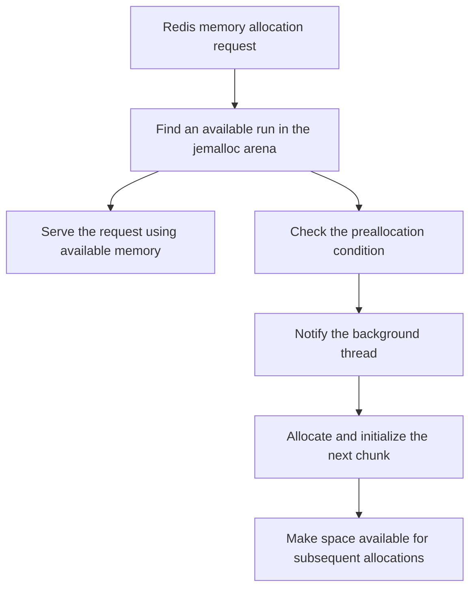
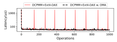
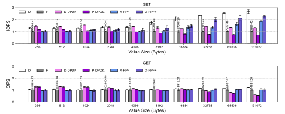
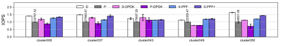
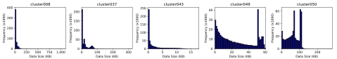

# X-redis

X-redis is a collaborative research project that addresses data movement and memory allocation bottlenecks in networked key-value stores using tiered memory.

Built on Redis with PMEM support, it combines PPF (Packet Peek and Forward) and OMA (Opportune Memory Allocator). PPF improves the data placement path for network requests. OMA moves memory allocation and initialization into the background to reduce latency spikes during request processing.

Wookyung Lee's contribution is OMA. The project and the performance results presented below are joint work by the paper's authors.

[Paper](https://doi.org/10.1109/CLOUD67622.2025.00050) · [OMA design](#oma-design) · [Evaluation](#evaluation) · [Code guide](#code-guide) · [Build and run](#build-and-run)

## Paper and authors

Avoiding Pitfalls in Networked Key-Value Store for Tiered Memory<br>
2025 IEEE 18th International Conference on Cloud Computing (CLOUD)

Seungmin Shin†, Leeju Kim†, Wookyung Lee†, Eyee Hyun Nam, Seungmin Kim, Bryan S. Kim, Sungjin Lee, Eunji Lee

† Equal contribution, as indicated in the paper.

DOI: [10.1109/CLOUD67622.2025.00050](https://doi.org/10.1109/CLOUD67622.2025.00050)

The project builds on Redis and its PMEM extension, jemalloc, memkind, and PMDK. These upstream components retain their respective authorship and license notices.

## Motivation

Redis with DRAM and Intel Optane DCPMM places indexes and small values in DRAM and larger values in DCPMM. Performance depends on both the memory devices and the software paths used to receive requests and allocate memory.

| Bottleneck | Approach | Technique |
| --- | --- | --- |
| Intermediate buffer copies and repeated kernel/user crossings during network receive | Inspect packet metadata with eBPF to support placement in the destination memory tier | PPF |
| Page zeroing and latency spikes when allocating new memory through Ext4-DAX | Allocate and initialize memory in the background before it is needed | OMA — my contribution |

## OMA design

### Moving allocation work off the request path

When jemalloc needs a new chunk, the DAX file system incurs physical memory allocation and initialization costs. The paper analyzes latency spikes caused by zeroing during 2 MB chunk allocation.

OMA prepares the next chunk in a background thread to reduce the time the request thread spends waiting for new memory.



This diagram illustrates the conceptual flow. Synchronous allocation may still be necessary if background allocation cannot keep up with demand.

### Preallocation timing and fragmentation

The policy described in the paper compares the expected memory consumption during allocation with the remaining space in the most recently allocated chunk.

Summing all free space in an arena can overestimate the space available for a large request when free runs are fragmented. Considering the latest chunk helps account for this fragmentation. Allocating additional space when needed also avoids reserving all available memory at startup.

### Implementation in this source tree

The OMA background allocation code is in [arena.c within memkind's bundled jemalloc](deps/memkind/jemalloc/src/arena.c).

- `threadInit`: initializes the background thread and synchronization objects.
- `arena_chunk_alloc_background_thread`: waits for a condition variable notification, then allocates the next chunk while holding the arena lock.
- `arena_run_split_remove`: checks the preallocation condition in the allocation path and notifies the background thread.

The current `WKLEE` path uses a fixed threshold: it compares the target run's `total_pages` with half the usable page count of a chunk. This differs from the adaptive policy based on allocation time and consumption described in the paper. Whether this source tree matches the final evaluation version remains to be verified.

## Evaluation

The following figures preserve the original vector graphics embedded in the published paper. SVG versions are displayed below, with extracted vector PDFs available for download. These are the authors' reported results, not new measurements from this checkout; the plotted data has not been estimated or reconstructed.

### 1. Allocation latency with and without OMA

<a href="docs/figures/oma-allocation-latency.svg"></a>

Source: Figure 5, p. 434 of the paper. © 2025 IEEE. [Vector PDF](docs/figures/oma-allocation-latency.pdf).

The DCPMM + Ext4-DAX path exhibits recurring spikes when allocating new chunks. OMA reduces these spikes by preparing memory in the background. The paper reports approximately 1,700 μs during new chunk allocation and zeroing. This figure measures allocation latency, not end-to-end request p99 latency.

### 2. Throughput when adding OMA to PPF

<a href="docs/figures/memtier-throughput.svg"></a>

Source: Figure 8, p. 437 of the paper. © 2025 IEEE. [Vector PDF](docs/figures/memtier-throughput.pdf).

| Label | Configuration |
| --- | --- |
| D | Redis using DRAM only |
| P | Baseline Redis using DRAM and DCPMM |
| D-DPDK / P-DPDK | Corresponding configurations with a DPDK-based network path |
| X-PPF | PPF enabled |
| X-PPF+ | PPF and OMA enabled |

The vertical axis shows normalized IOPS, with P set to 1. Numbers above the P bars are the baseline's absolute IOPS. Compare X-PPF with X-PPF+ to assess the additional effect of OMA.

For 128 KB SET operations, the paper reports 2.28× baseline throughput, a 128% increase, with X-PPF+. This is the result of combining PPF and OMA, rather than an OMA-only result.

### 3. Twitter workloads

The paper evaluates five Twitter memcache traces using an extended Memtier benchmark with eight threads. The workloads mix SET and GET requests and vary both key and value sizes. Four traces were selected for their high SET ratios, and cluster043 was added to evaluate smaller writes.

| Trace | Category | Key size | Average value size |
| --- | --- | --- | --- |
| cluster008 | Computation | 23 B | 18.2 KB |
| cluster037 | Computation | 72 B | 16.4 KB |
| cluster043 | Computation | 44 B | 1.9 KB |
| cluster049 | Storage | 44 B | 25.4 KB |
| cluster050 | Computation | 18 B | 67.8 KB |

Workload characteristics are from Table II of the paper.

<a href="docs/figures/twitter-throughput.svg"></a>

Source: Figure 10, p. 439 of the paper. © 2025 IEEE. [Vector PDF](docs/figures/twitter-throughput.pdf).

Across these workloads, the paper reports that X-PPF+ achieves an average 32.7% higher IOPS than P and is only 3.7% below the DRAM-only configuration D. P is on average 27.4% below D. These are reported averages for the combined PPF and OMA system. As in Figure 8, comparing X-PPF with X-PPF+ shows the additional effect of OMA.

<a href="docs/figures/twitter-value-distribution.svg"></a>

Source: Figure 11, p. 439 of the paper. © 2025 IEEE. [Vector PDF](docs/figures/twitter-value-distribution.pdf).

The distributions provide context for the throughput differences. The paper attributes X-redis's slight advantage over D on cluster049 to the workload's high variation in value sizes and its interaction with Redis's query-buffer sizing heuristic. The trace-based evaluation complements the fixed-value-size Memtier experiments.

### Experimental setup reported in the paper

| Component | Configuration |
| --- | --- |
| Server | Supermicro SYS-1029U-TRT, dual-socket Intel Xeon Gold 5125, 2.5 GHz |
| Memory | 128 GB DRAM and 512 GB Intel Optane DCPMM |
| File system | Ext4-DAX |
| Network | 56 Gb Ethernet between client and server |
| Figure 8 workload | Memtier, one million SET and GET operations each, eight threads |
| Figure 8 value sizes | 256 B–128 KB |
| Twitter workload | Five memcache traces, mixed SET/GET, eight threads |
| Repetitions | Average of five runs |

See the [figure notes](docs/figures/README.md) for attribution and extraction details.

## Repository layout

| Directory | Purpose | Start here |
| --- | --- | --- |
| `src/` | Redis server, request handling, data structures, and PMEM/BPF integration | [Source guide](src/README.md) |
| `BasicBPF/` | PPF packet inspection program and standalone development utilities | [BPF guide](BasicBPF/README.md) |
| `deps/` | Bundled libraries and dependency build scripts | [Dependency guide](deps/README.md) |
| `deps/memkind/jemalloc/` | Bundled allocator containing the OMA background allocation path | [OMA implementation guide](deps/memkind/OMA.md) |
| `tests/` | Redis unit, integration, cluster, and Sentinel tests, plus additional test scripts | [Test guide](tests/README.md) |
| `utils/` | Redis development, administration, and diagnostic utilities | [Utility guide](utils/README.md) |
| `docs/figures/` | Published evaluation figures in SVG and vector PDF formats | [Figure sources](docs/figures/README.md) |
| `docs/scripts/` | Reproducible extraction of vector figures from the paper | [Extraction script](docs/scripts/extract_figures.py) |
| `temp/` | Standalone map implementation and its small test program | [map.c](temp/map.c), [test.c](temp/test.c) |

To review OMA, start with its [implementation guide](deps/memkind/OMA.md), then follow the allocator functions it links. To review PPF, read the [BPF guide](BasicBPF/README.md) alongside the Redis [source guide](src/README.md).

### Root files and scripts

| File | Purpose |
| --- | --- |
| [Makefile](Makefile) | Top-level entry point for the Redis build |
| [redis.conf](redis.conf), [redis.conf2](redis.conf2) | Runtime configurations, including PMEM paths and capacity |
| [1_Make.sh](1_Make.sh) | Build the BPF object, copy it to the root, and build Redis with NVM/BPF enabled |
| [2_Run.sh](2_Run.sh) | Delete a specific PMEM backing file and start Redis |
| [3_distclean.sh](3_distclean.sh) | Delete matching PMEM backing files, clean the build, and rebuild |
| [break.py](break.py), [cal.sh](cal.sh) | Experimental log-processing and timing-analysis scripts with fixed input assumptions |

The run and cleanup scripts contain deletion commands and environment-specific paths. See [Build and run](#build-and-run) for the direct server command and prerequisites. Checked-in binaries, object files, and backup variants are historical development artifacts; use source files and the documented build path when reviewing the implementation.

## Code guide

| Path | Role |
| --- | --- |
| [deps/memkind/jemalloc/src/arena.c](deps/memkind/jemalloc/src/arena.c) | OMA background chunk allocation and notification path |
| [deps/memkind/src/memkind_pmem.c](deps/memkind/src/memkind_pmem.c) | File-backed PMEM allocation |
| [deps/build-memkind.sh](deps/build-memkind.sh) | Build script for memkind and its bundled jemalloc |
| [src/Makefile](src/Makefile) | NVM/BPF build options and library linking |
| [src/networking.c](src/networking.c) | Redis network request handling and BPF integration |
| [BasicBPF/packet_size_kern.c](BasicBPF/packet_size_kern.c) | Kernel-side packet metadata handling |
| [redis.conf](redis.conf) | Redis and NVM runtime configuration |

For OMA, inspect `deps/memkind/jemalloc/`. The NVM build links this bundled jemalloc library; the separate `deps/jemalloc/` directory is a different copy.

## Build and run

This research source tree includes configuration from the original experimental environment. The steps below reflect the source and scripts; building and running them in a fresh environment has not been revalidated.

### Prerequisites

- Linux with eBPF support and the permissions needed to load BPF programs.
- C/C++ build tools, Clang with the BPF target, libbpf, and the build dependencies for memkind and PMDK.
- A PMEM device must be mounted with a DAX-enabled file system before running X-redis with NVM support. The paper uses Intel Optane DCPMM with Ext4-DAX. Set `nvm-dir` in `redis.conf` to a writable directory on that mount, such as `/mnt/pmem0`; creating an ordinary directory alone does not mount the device.
- Update the libbpf search path in [src/Makefile](src/Makefile), which currently contains an absolute path from the original environment.
- Adjust `nvm-dir` (currently `/mnt/pmem0`), `nvm-maxcapacity` (currently `200`), ports, and file paths in [redis.conf](redis.conf) for your environment.

### Build

Run from the repository root:

```bash
# Build the kernel-side BPF object.
(cd BasicBPF && bash 1_make_k.sh)
cp BasicBPF/packet_size_kern.o ./packet_size_kern.o

# Build Redis with NVM and BPF support.
make USE_NVM=yes USE_BPF=yes -j
```

`USE_BPF` controls the PPF-related build path. The OMA path is controlled by the `WKLEE` macro in the bundled jemalloc, so the options above do not by themselves switch between the paper's X-PPF and X-PPF+ configurations.

### Run

After mounting the PMEM device and preparing the libraries, permissions, and configuration, run from the repository root:

```bash
./src/redis-server redis.conf
```

The existing `2_Run.sh` deletes a specific PMEM file before starting Redis. The command above starts the server directly.

## Reproducibility and upstream software

- The figures describe the published experiments. Identical performance and equivalence to the final paper version have not been verified for this checkout.
- Kernel, compiler, and library version pinning, along with automated OMA comparison experiments, require further work for reproducibility.
- Refer to the copyright and license notices of Redis, jemalloc, memkind, PMDK, and other bundled components for their respective terms and attribution.
