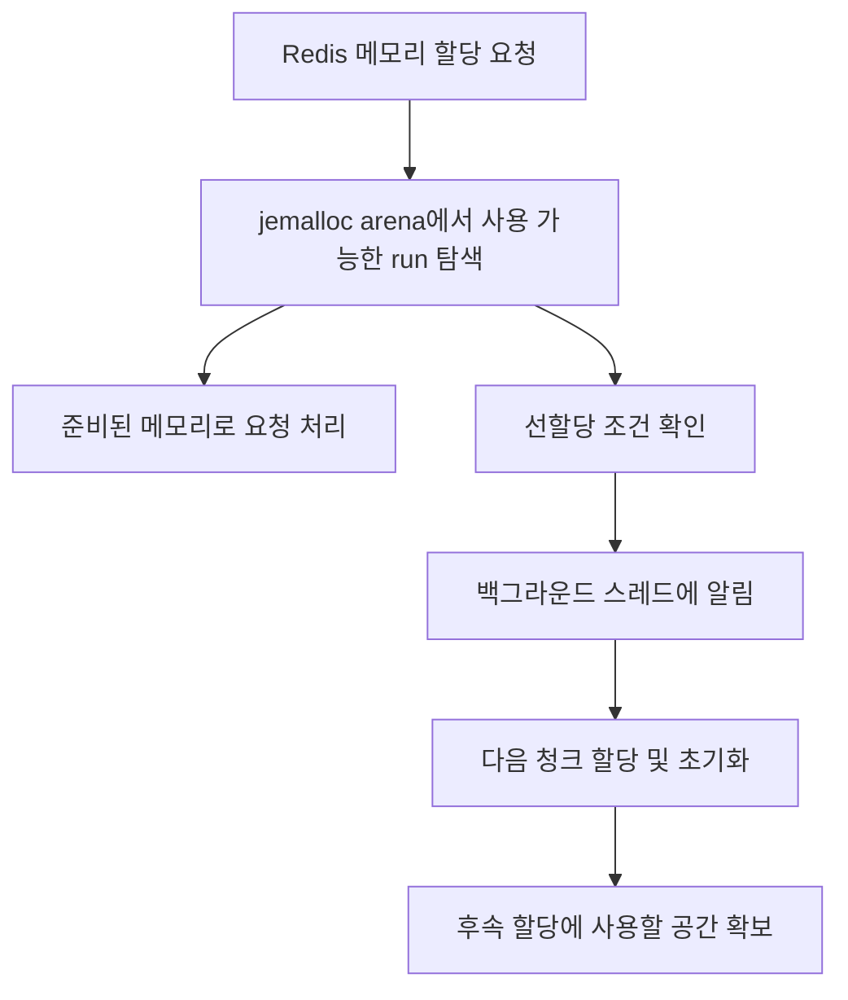
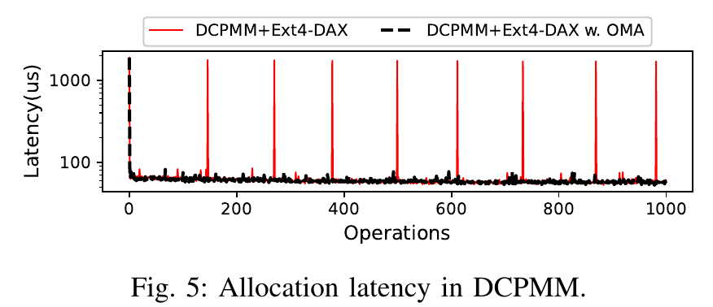
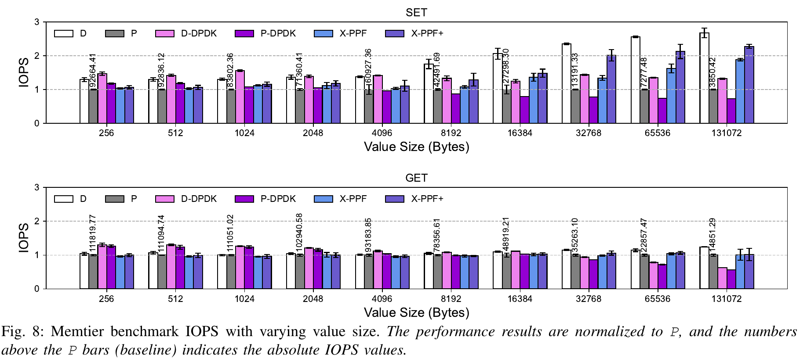

# X-redis

**계층형 메모리를 사용하는 네트워크 Key-Value Store의 데이터 이동 및 메모리 할당 병목을 개선하는 공동 연구 프로젝트입니다.**

Redis 기반 시스템에 **PPF(Packet Peek and Forward)**와 **OMA(Opportune Memory Allocator)**를 적용합니다. PPF는 네트워크 요청의 데이터 배치 경로를 개선하고, OMA는 메모리 할당·초기화 비용을 백그라운드로 옮겨 요청 처리 중 발생하는 지연 급증을 완화합니다.

> **개인 담당 범위 — Wookyung Lee: OMA.** 이 저장소는 공동 연구 결과물이며, PPF와 X-redis 전체를 개인 단독 구현으로 주장하지 않습니다. 아래 성능 그래프는 논문에 보고된 공동 연구 결과입니다.

[논문](https://doi.org/10.1109/CLOUD67622.2025.00050) · [OMA 설계](#oma-설계) · [성능 평가](#성능-평가) · [코드 안내](#코드-안내) · [빌드와-실행](#빌드와-실행)

## 논문 및 저자

**Avoiding Pitfalls in Networked Key-Value Store for Tiered Memory**<br>
2025 IEEE 18th International Conference on Cloud Computing (CLOUD)

Seungmin Shin\*, Leeju Kim\*, **Wookyung Lee\***, Eyee Hyun Nam, Seungmin Kim, Bryan S. Kim, Sungjin Lee, Eunji Lee<br>
\* Equal contribution (논문 표기).

DOI: [10.1109/CLOUD67622.2025.00050](https://doi.org/10.1109/CLOUD67622.2025.00050)

기존 Redis 및 PMEM 확장, jemalloc, memkind, PMDK 등을 기반으로 한 연구입니다. 기반 소프트웨어의 구현과 공동 연구의 기여, 개인 담당 범위를 구분해 읽어 주세요.

## 해결하려는 문제

DRAM과 Intel Optane DCPMM을 함께 사용하는 Redis에서는 인덱스와 작은 값을 DRAM에, 큰 값을 DCPMM에 배치합니다. 이때 성능 저하는 메모리 장치의 속도 차이뿐 아니라 소프트웨어의 요청 처리 방식에서도 발생합니다.

| 병목 | 접근 | 기법 |
| --- | --- | --- |
| 네트워크 수신 과정의 중간 버퍼 복사와 반복적인 커널·사용자 공간 전환 | eBPF로 패킷 정보를 확인하고 최종 메모리 계층으로의 데이터 배치를 지원 | PPF |
| Ext4-DAX의 새 메모리 할당 과정에서 발생하는 페이지 zeroing과 지연 급증 | 필요한 메모리를 백그라운드에서 선할당·초기화 | OMA — 개인 담당 |

## OMA 설계

### 할당 지연을 요청 처리 경로 밖으로 이동

jemalloc이 사용할 공간을 확보하기 위해 새 청크를 할당하면, DAX 파일 시스템에서 물리 메모리 확보 및 초기화 비용이 발생합니다. 논문에서는 2 MB 청크 할당 과정의 zeroing이 지연 급증을 일으키는 현상을 분석합니다.

OMA는 메모리가 고갈된 뒤 요청 처리 스레드가 할당을 기다리는 상황을 줄이기 위해 백그라운드 스레드에서 다음 청크를 준비합니다.



위 그림은 OMA의 개념적 흐름입니다. 백그라운드 작업이 수요를 따라가지 못하면 동기 할당이 필요할 수 있습니다.

### 선할당 시점과 단편화

논문의 정책은 **할당에 걸리는 시간 동안 소비될 것으로 예상되는 메모리량**과 **가장 최근 할당한 청크의 잔여 공간**을 비교합니다.

arena 전체의 여유 공간만 합산하면, 작은 run들이 흩어져 있어 큰 요청을 수용할 수 없는 상황을 놓칠 수 있습니다. 최근 청크의 잔여 공간을 고려하는 것은 이러한 단편화의 영향을 반영하기 위한 선택입니다. 또한 시작 시 전체 메모리를 미리 할당하는 방식 대신, 필요 시점에 맞춰 추가 공간을 준비합니다.

### 이 소스 트리에서 확인할 구현

개인 담당인 OMA의 백그라운드 할당 코드는 [memkind 내부 jemalloc의 arena.c](deps/memkind/jemalloc/src/arena.c)에 있습니다.

- `threadInit`: 백그라운드 스레드와 동기화 객체 초기화.
- `arena_chunk_alloc_background_thread`: 조건 변수 알림을 기다린 뒤 arena lock 아래에서 다음 청크 할당.
- `arena_run_split_remove`: 할당 경로에서 조건을 확인하고 백그라운드 스레드에 알림.

**논문 정책과 현재 코드의 차이:** 이 소스 트리의 `WKLEE` 경로는 대상 run의 `total_pages`를 청크 사용 가능 페이지 수의 절반과 비교하는 고정 임계값 조건을 사용합니다. 논문에 설명된 할당 시간·소비량 기반 적응형 정책과 동일한 구현으로 간주하면 안 됩니다. 현재 코드가 논문 최종 평가 버전과 일치하는지는 별도 확인이 필요합니다.

## 성능 평가

아래 그래프는 **논문에서 발췌한 결과**이며, 이 체크아웃에서 새로 실행한 벤치마크가 아닙니다. 원본 그래프를 잘라 수록했으며 데이터를 추정하거나 재구성하지 않았습니다.

### 1. OMA 적용 전후의 할당 지연



*출처: 논문 Figure 5, p. 434. © 2025 IEEE.*

기존 DCPMM + Ext4-DAX 경로는 새 청크 할당 시 지연이 반복적으로 급증합니다. OMA 적용 결과는 이러한 급증을 완화하는 모습을 보여줍니다. 논문 본문은 새 청크 할당과 zeroing 시 약 **1,700 μs**의 지연을 보고합니다. 이 그림은 할당 지연을 보여주며, 전체 요청의 p99 지연 지표는 아닙니다.

### 2. PPF에 OMA를 추가했을 때의 처리량



*출처: 논문 Figure 8, p. 437. © 2025 IEEE.*

| 표기 | 구성 |
| --- | --- |
| D | DRAM만 사용하는 Redis |
| P | DRAM + DCPMM을 사용하는 기준 시스템 |
| D-DPDK / P-DPDK | 각 구성에 DPDK 기반 네트워크 경로 적용 |
| X-PPF | PPF 적용 |
| X-PPF+ | PPF + OMA 적용 |

세로축은 **P의 처리량을 1로 둔 정규화 IOPS**입니다. P 막대 위 숫자는 기준 시스템의 실제 IOPS입니다. **OMA의 추가 효과는 X-PPF와 X-PPF+를 비교해서 읽어야 합니다.**

논문은 128 KB SET에서 X-PPF+가 기준 시스템 대비 **2.28배의 처리량(128% 증가)**을 달성했다고 보고합니다. 이는 **PPF와 OMA를 결합한 전체 시스템 성과**이며 OMA 단독 성과가 아닙니다.

### 논문 실험 조건

| 항목 | 논문에 보고된 조건 |
| --- | --- |
| 서버 | Supermicro SYS-1029U-TRT, dual-socket Intel Xeon Gold 5125, 2.5 GHz |
| 메모리 | DRAM 128 GB, Intel Optane DCPMM 512 GB |
| 파일 시스템 | Ext4-DAX |
| 네트워크 | 클라이언트와 56 Gb Ethernet 연결 |
| Figure 8 워크로드 | Memtier, SET/GET 각각 100만 연산, 8개 스레드 |
| 값 크기 | 256 B–128 KB |
| 반복 측정 | 5회 측정한 평균 |

그림의 출처와 추출 정보는 [그래프 안내](docs/figures/README.md)에 기록했습니다.

## 코드 안내

| 경로 | 역할 |
| --- | --- |
| [deps/memkind/jemalloc/src/arena.c](deps/memkind/jemalloc/src/arena.c) | OMA 관련 백그라운드 청크 할당 및 알림 경로 |
| [deps/memkind/src/memkind_pmem.c](deps/memkind/src/memkind_pmem.c) | PMEM 파일 기반 메모리 확보 경로 |
| [deps/build-memkind.sh](deps/build-memkind.sh) | memkind 및 내부 jemalloc 빌드 |
| [src/Makefile](src/Makefile) | NVM/BPF 빌드 옵션과 라이브러리 연결 |
| [src/networking.c](src/networking.c) | Redis 네트워크 요청 처리 및 BPF 연동 |
| [BasicBPF/packet_size_kern.c](BasicBPF/packet_size_kern.c) | 커널 측 패킷 정보 처리 |
| [redis.conf](redis.conf) | Redis와 NVM 관련 실행 설정 |

OMA를 검토할 때는 최상위 `deps/jemalloc/`과 구분해서 **`deps/memkind/jemalloc/`**을 확인해야 합니다. NVM 빌드에서는 이 내부 jemalloc 라이브러리를 연결합니다.

## 빌드와 실행

이 저장소는 기존 실험 환경의 설정을 포함하는 연구용 소스 트리입니다. 아래는 소스와 스크립트에서 확인한 절차이며, 새로운 환경에서 빌드·실행을 재검증하지 않았습니다.

### 준비 사항

- Linux 및 eBPF를 지원하는 커널, BPF 프로그램 로딩에 필요한 권한.
- C/C++ 빌드 도구, Clang의 BPF target, libbpf, memkind/PMDK 빌드 의존성.
- 논문 환경을 재현하려면 DCPMM 및 Ext4-DAX 마운트가 필요합니다.
- [src/Makefile](src/Makefile)의 libbpf 검색 경로에 기존 실험자의 절대 경로가 있으므로 설치 환경에 맞게 수정해야 합니다.
- [redis.conf](redis.conf)의 `nvm-dir`(현재 `/mnt/pmem0`), `nvm-maxcapacity`(현재 `200`), 포트 및 파일 경로를 실행 환경에 맞게 조정해야 합니다.

### 빌드

저장소 최상위 디렉터리에서 실행합니다.

```bash
# 커널 측 BPF 오브젝트 생성
(cd BasicBPF && bash 1_make_k.sh)
cp BasicBPF/packet_size_kern.o ./packet_size_kern.o

# NVM과 BPF를 활성화한 Redis 빌드
make USE_NVM=yes USE_BPF=yes -j
```

`USE_BPF`는 PPF 관련 빌드 옵션입니다. OMA 경로는 내부 jemalloc의 `WKLEE` 매크로로 제어되므로, 위 옵션만으로 논문의 X-PPF/X-PPF+ 비교 구성이 전환되지는 않습니다.

### 실행

필요한 장비, 라이브러리, 권한 및 설정을 준비한 뒤 저장소 최상위에서 실행합니다.

```bash
./src/redis-server redis.conf
```

기존 `2_Run.sh`에는 특정 PMEM 파일을 삭제하는 명령이 포함되어 있습니다. 실행 예시는 서버를 직접 실행하는 방식으로 제시했습니다.

## 재현 범위와 기반 소프트웨어

- 논문의 그래프는 출판 당시 실험 결과입니다. 현재 체크아웃의 동일 성능 또는 논문 최종 버전과의 일치를 보증하지 않습니다.
- 커널·컴파일러·라이브러리 버전 고정과 OMA 비교 실험 자동화는 재현 환경 정리 시 추가 확인이 필요합니다.
- 기존 Redis, jemalloc, memkind, PMDK 등 각 구성요소의 저작권 및 라이선스 고지를 확인해 주세요. 이 README는 해당 소프트웨어의 저작권이나 기여자를 대체하지 않습니다.
